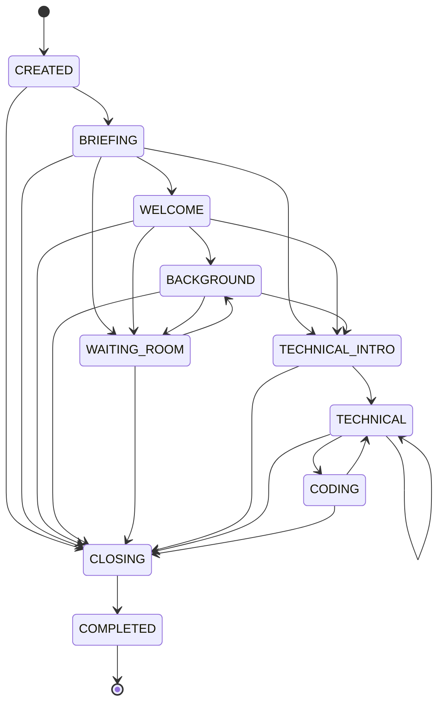

# Interview state machine

Rewritten in H6-B from `agent/agent/interview/state_machine.py`. The
previous version listed five phases; there are ten, and it was missing the
two that shape the B2B flow — `BRIEFING` and `WAITING_ROOM`.

The split it described is still the guiding idea, and is worth keeping:

> The application controls the **phases**; the LLM chooses its **action**
> within the phase it is in.

`state_machine.py` is the table. `controller.py` decides which transition to
take and is a frozen contract (AGENTS.md §2).

## Phases

| Phase | What happens | Notes |
|---|---|---|
| `CREATED` | Nothing is spoken | The session exists; the candidate has not started. The only silent phase besides `COMPLETED` |
| `BRIEFING` | The interviewer explains how this will work | Added for the B2B flow |
| `WELCOME` | Greeting, sound check | |
| `BACKGROUND` | The CV-grounded and HR-authored verbal questions | The ordered-question walk lives here |
| `WAITING_ROOM` | Silent pause between sections | The candidate proceeds, or a timeout does it for them. No LLM generation at all |
| `TECHNICAL_INTRO` | Presents a coding or MCQ question | |
| `TECHNICAL` | Discussion of the approach | Self-transition: one per question in the walk |
| `CODING` | The candidate writes code; hints and clarifications | Returns to `TECHNICAL` |
| `CLOSING` | The interviewer wraps up | Reachable from every phase — the `END_INTERVIEW` escape hatch |
| `COMPLETED` | Terminal | Silent. The evaluation is submitted around this point |

`TECHNICAL -> TECHNICAL` is not a mistake: the ordered walk re-enters the
phase for each question rather than inventing a phase per question.

## Actions the LLM may choose

`ASK`, `LISTEN`, `FOLLOW_UP`, `CLARIFY`, `HINT`, `ACKNOWLEDGE`,
`TRANSITION`, `EVALUATE` — filtered per phase by
`VALID_ACTIONS_PER_PHASE`. An action the current phase does not allow is
replaced with `ACKNOWLEDGE` and logged; the LLM cannot talk the interview
into a state the table forbids.

`CREATED`, `WAITING_ROOM` and `COMPLETED` allow **no** actions, which is how
silence is enforced rather than hoped for.

## Controls the candidate may use

From `CandidateControlAction`, gated per phase by
`VALID_CANDIDATE_CONTROLS_PER_PHASE`: `SKIP_QUESTION`, `CHANGE_QUESTION`,
`SKIP_SECTION`, `SKIP_BACKGROUND`, `MOVE_TO_TECHNICAL`, `REPEAT_QUESTION`,
`REQUEST_CLARIFICATION`, `REQUEST_HINT`, `END_SECTION_EARLY`,
`PROCEED_TO_NEXT_SECTION`, `END_INTERVIEW`. Plus `SUBMIT_CODE`,
`SUBMIT_MCQ_ANSWER` and `IM_READY`, which are commands rather than gated
controls.

Two rules worth knowing:

- **`END_INTERVIEW` is available everywhere.** Every phase can reach
  `CLOSING`.
- **Spoken intent is not a control.** Saying "I'm done" emits a
  `CONFIRM_INTENT` event and changes nothing until the candidate confirms
  through the real control (H2-C). Before that, a phrase in conversation
  could end an interview.

## Guardrails the controller enforces

- **Time.** Per-section budgets from `InterviewSection.config`; expiry
  forces a transition rather than overrunning.
- **Follow-ups.** Verbal questions allow up to two, throttled by the time
  tier; coding and MCQ allow none.
- **Hints.** Graduated, capped per question, and never the answer.
- **Failure.** Any LLM error becomes the localised fallback line, so a
  provider outage is a spoken sentence rather than silence
  (`controller.py`, around line 637).
- **Resume.** A reconnecting candidate returns to the persisted phase and
  question pointer, not to the beginning (`runtime/bootstrap.py`).

## Where this is verified

`agent/test_skip_regressions.py` (108 tests) covers the transitions and the
controls, `agent/agent/tests/test_controller_h2c.py` the confirmation
behaviour, and `agent/agent/tests/test_bootstrap_resume.py` what a resume
restores.
