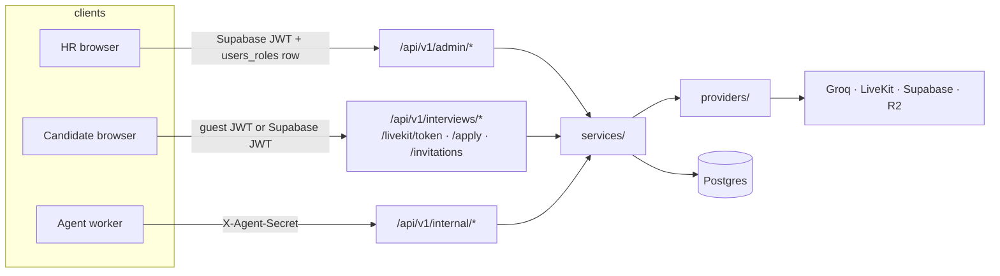

# System architecture

Rewritten in H6-B from the repository as it stands. The hardening plan's §2
describes a *target* layout that differs from what was built in several
places — it names `providers/jobs/`, `workers/`, `compose.yaml` and
`storage/s3_compatible.py`, where the code has `providers/queue/`,
`services/tasks/`, `docker-compose.yml` and `storage/s3.py`. This file
follows the code.

## Repository

```
Himma_v2/
  docker-compose.yml        dev stack: postgres, postgres-test, migrate, backend, agent, frontend
  compose.prod.yaml         deployable stack: migrate, backend, agent, web (nginx)
  conftest.py               redirects every suite to the disposable test database
  ruff.toml  pytest.ini  Makefile  scripts/dev.ps1
  .github/workflows/ci.yml
  scripts/generate_docs.py  regenerates the env matrix and the data model

  backend/
    Dockerfile  docker-entrypoint.sh  requirements.{in,txt}
    alembic/versions/        24 revisions, additive-only
    backend/
      main.py                app, middleware order, lifespan, /health /ready /metrics
      cli.py                 python -m backend.cli <command>
      core/
        config.py            one typed Settings, fail-closed outside local/test
        errors.py            AppError hierarchy -> RFC 7807 problem responses
        logging.py           JSON logs, request_id / session_id contextvars
        metrics.py           Prometheus collectors + the HTTP middleware
        ratelimit.py         token buckets, per scope and caller
        request_id.py        X-Request-ID in, out and into the log context
        background.py        tracked fire-and-forget tasks, drained on shutdown
      providers/             ports + adapters, chosen by settings
        llm/ storage/ realtime/ email/ notifications/ queue/
      services/              domain logic, lifted out of the routers
        sessions/ evaluations/ results/ tasks/
        audit.py data_deletion.py publish_rules.py resume_ingest.py ...
      api/endpoints/         thin routers: parse -> call a service -> respond
      models/ schemas/ db/
    tests/                   unit + integration against the disposable Postgres

  agent/
    Dockerfile  start.sh  requirements.{in,txt}
    agent/
      main.py                entrypoint, prewarm, lease loop, shutdown reasons
      config.py              AgentSettings
      logging_setup.py       one handler, session/agent/job ids on every line
      runtime/               bootstrap.py (build_context), teardown.py
      interview/
        controller.py        FROZEN - the interview's brain (AGENTS.md §2)
        voice_adapter.py     LiveKit audio + data channel, ui_command validation
        state_machine.py     phases and what each allows
        persistence.py       the /internal client: retries, outbox, lease
        tts_cache.py groq_key_rotator.py questions.py planner.py ...
      llm/ providers/ tests/

  frontend/
    Dockerfile  nginx/         production image: built bundle behind nginx
    src/
      config.ts              the only reader of VITE_*, plus the runtime overlay
      lib/api.ts             fetch wrapper: ApiError, timeouts, tasks.ts polling
      routes/admin/          HR: jobs, sections, questions, results
      features/interview-session/   the candidate's live interview
      services/livekit/      room connection, data channel
      context/ components/ locales/
  tests/legacy/              the phase-by-phase suites, moved unchanged in H0
  docs/                      architecture, technical, handover, adr
```

## Request paths

Three, and they authenticate differently.



`/internal/*` and `agent/interview/controller.py` are **frozen contracts**
(AGENTS.md §2): they change only under an approved sub-phase.

## How a request is handled

Middleware runs outermost-first: `RequestIdMiddleware` (so an id exists
even for a response CORS itself produces), then `MetricsMiddleware`, then
CORS. Routers do no domain work — they parse, call a service, and return a
typed model. Every failure becomes one RFC 7807 body with the request id in
it (`core/errors.py`).

Anything slower than a request gets off the request: the four AI actions
enqueue a `Task` and answer 202, and the browser polls
`GET /admin/tasks/{id}` (`services/tasks/`). Recording starts are
fire-and-forget through `core/background.py`, claimed in the database so
one session can only ever start one.

## Background work in the backend

| Loop | Started by | Safe with N replicas because |
|---|---|---|
| Idle-disconnect sweep | `main.py` lifespan | one `pg_try_advisory_xact_lock` per interval |
| Task worker(s) | `main.py` lifespan | rows claimed with `FOR UPDATE SKIP LOCKED` |
| Recording start | `services/sessions/room_token.py` | a conditional `UPDATE` claims the session |

Rate limits are the exception: they live in process memory, so N replicas
enforce N times the limit (`core/ratelimit.py`).

## The agent's shape

One worker process registers with LiveKit and receives one job per
interview. Each job: `bootstrap.build_context` loads the session over
`/internal`, decides whether this is a fresh start or a resume, and writes
`SESSION_STARTED` or `SESSION_RECONNECTED`; `voice_adapter` wires STT, the
LLM and TTS to the room and validates every `ui_command`; `controller`
decides what the interviewer does; `teardown` guarantees the session ends
in a terminal or `DISCONNECTED` state, never stranded `IN_PROGRESS`. A lease
is renewed throughout, and losing it stops the worker driving the session
so two workers never fight over one interview.

## Decisions behind this shape

`docs/adr/` records the architectural ones (S1–S12 of the hardening plan):
provider ports, DB-backed queue instead of Redis, one typed Settings,
additive-only migrations. `docs/CURRENT_DECISIONS.md` remains the product
decision log.
