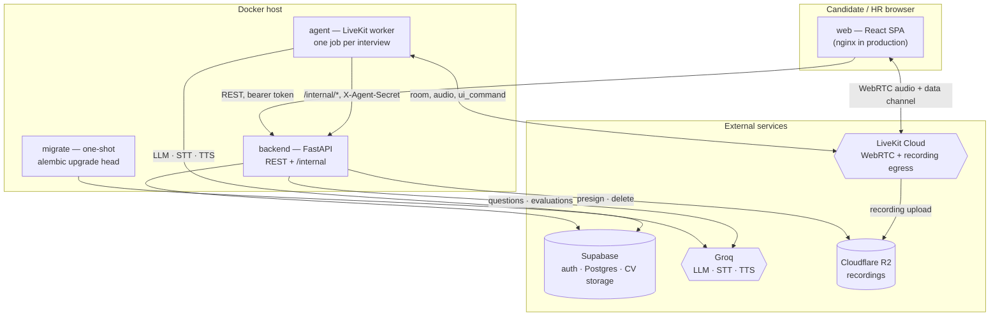

# System context

Rewritten in H6-B. The previous version of this file named **Deepgram** for
speech and **OpenAI GPT-4o** for reasoning, and described candidates
configuring their own interviews. None of that is true: the providers are
Groq, and interviews are authored by HR against a Job. It was written
before the B2B transition and was never revised, which is worth knowing
when reading any pre-hardening document here.

## What this system is

HR authors an interview once, against a job opening. Candidates are invited
(or apply through a public link), sit a voice interview with an AI
interviewer, and HR reads a structured evaluation. The guiding principle,
unchanged since Phase 0:

> The LLM is the interviewer intelligence; the application controls the
> interview.

The application owns the lifecycle, the clock, phase transitions and the
guardrails. The LLM handles conversation and reasoning inside the bounds it
is given.

## Actors

| Actor | How they arrive | What they do |
|---|---|---|
| **HR / admin** | Supabase sign-in plus a `users_roles` row | Create a job, configure sections and questions (AI-assisted), publish, invite candidates, read results |
| **Candidate (invited)** | A personalised invitation, redeemed with an OTP | Upload a CV, sit the interview |
| **Candidate (public link)** | A public job link, self-registration | Same, with a guest credential scoped to one session |
| **AI interviewer** | A LiveKit worker process, one per interview | Conducts the interview, keeps state, evaluates |

## The four processes

Two things in that picture are easy to get wrong:

- **The agent never touches the database.** It reaches everything through
  the backend's `/internal/*` routes, authenticated with a shared secret.
  That is why an agent deployment needs no `DATABASE_URL`.
- **The browser talks to LiveKit directly.** The backend only mints the
  room token. Media never passes through this system's own servers.

## External services, and what breaks without each

| Service | Used for | If it is down |
|---|---|---|
| **Supabase** | Auth (admin + invited candidates), Postgres, CV file storage | Auth: sign-ins fail, existing tokens keep working until expiry. Postgres: `/ready` reports 503 and the API cannot serve |
| **LiveKit Cloud** | Rooms, participant tokens, recording egress | No interview can start; a running one ends `DISCONNECTED` and the sweep finalises it |
| **Groq** | LLM (both services), STT and TTS (agent) | Authoring and evaluation fail with a typed error; a live interview stalls and ends `DISCONNECTED` |
| **Cloudflare R2** | Interview recordings, written by LiveKit egress | The interview proceeds **unrecorded**, logged; nothing else is affected |

`TTS_PROVIDER=azure` selects Azure Speech instead of Groq for
text-to-speech; everything else stays the same.

## Where to read next

- `system-architecture.md` — the repository and the runtime, module by module.
- `voice-sequence.md` — apply → interview → finalize, as sequence diagrams.
- `interview-state-machine.md` — the phases and what may happen in each.
- `../handover/deploy.md` — how to run all of this somewhere.
- `../handover/security.md` — trust boundaries and where personal data lives.
