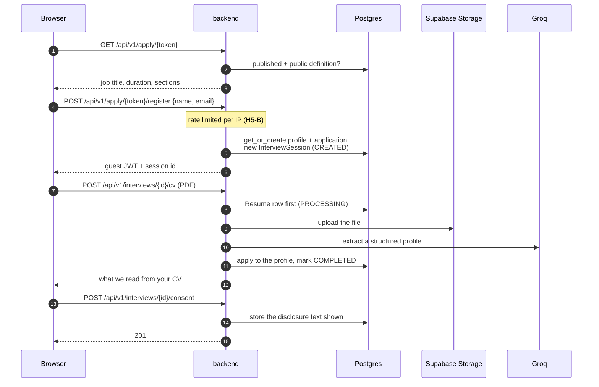
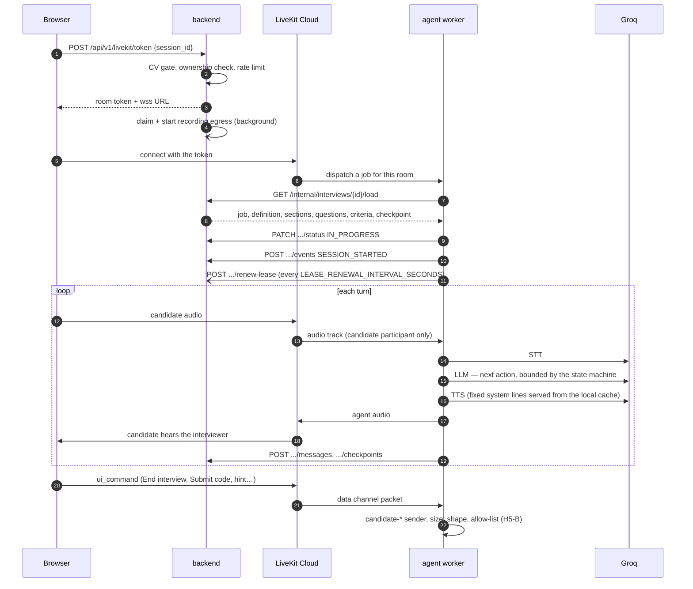
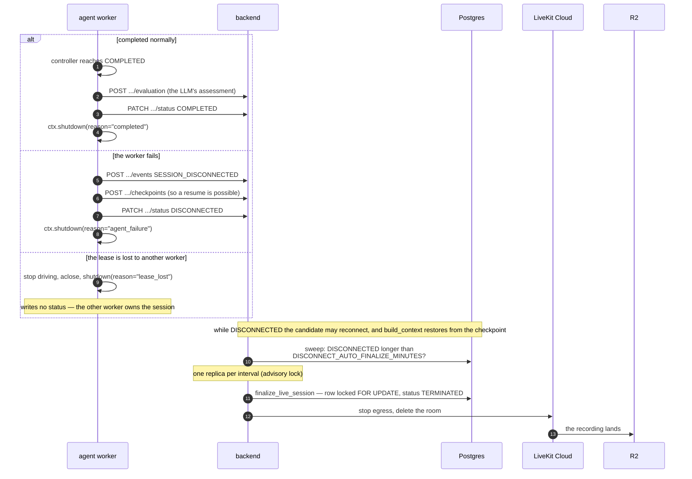

# Sequences: apply → interview → finalize

Rewritten in H6-B from the code. The previous version described
`POST /sessions/{id}/start` (no such route), the backend "dispatching a job"
to the agent (LiveKit does that, by room), and Deepgram/OpenAI (it is Groq).
Route names below are the real ones.

## 1. Apply and prepare

The public-link flow. The invitation flow differs only at the start: HR
creates the invitation, the candidate redeems it with an OTP at
`POST /api/v1/invitations/{token}/redeem`, and arrives at the same place.

The CV is a gate, not a nicety: `POST /livekit/token` answers `409
CV_REQUIRED` until one is attached.

## 2. The interview

Barge-in: when the candidate speaks over the interviewer, the adapter clears
the audio queue (`AudioSource.clear_queue`) as well as invalidating the
in-flight generation — clearing the queue was the fix in RT-B1, because
frames already buffered by LiveKit kept playing without it.

## 3. Finalize

Three ways an interview ends, and they converge.

An HR-triggered regeneration (`POST /admin/interviews/{id}/regenerate-evaluation`)
runs the same evaluation later, as a queued task, for a session that ended
with only a placeholder.

## What guarantees these sequences

| Property | Mechanism |
|---|---|
| A session never stays `IN_PROGRESS` after the worker dies | `runtime/teardown.py`, plus the sweep as a backstop |
| Two workers never drive one interview | the lease; losing it stops the worker without writing status |
| One interview, at most one recording | a conditional `UPDATE` claims the start (H5-B) |
| A message sequence never repeats after a resume | `build_context` takes the higher of checkpoint and messages |
| A candidate cannot reach another's session | owner checks on every route, tested in `test_auth_matrix.py` |
